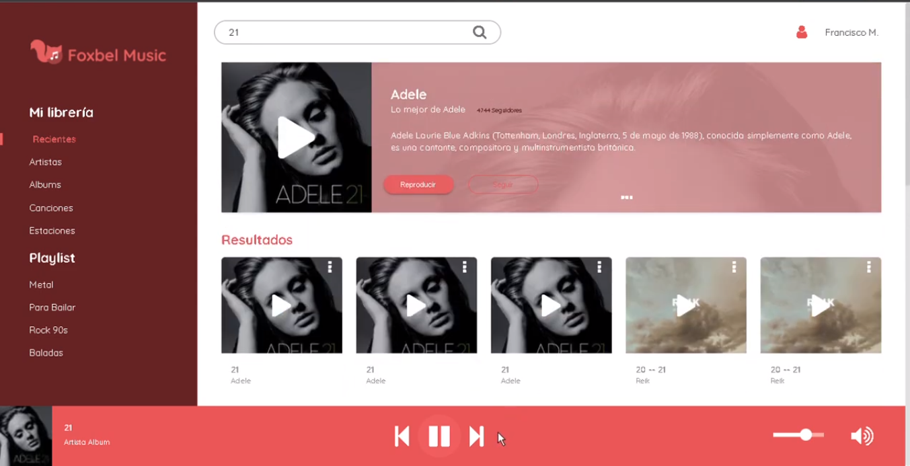

FOXBEL

PUEDE SER INICIADO POR LA CONFIGURACION DE LOGIN DE LA API

https://connect.deezer.com/oauth/auth.php?app_id=476462&redirect_uri=http://localhost:8080/foxbel/admin-foxbel&perms=basic_access,email

ESTE PROYECTO USA UN PASE DE SERVIDOR, PARA HABILITAR LA PETICION A LA API. ACEPTAR LAS CONDICIONES DE SERVICIO EN LA SIGUIENTE DIRECCCION:

https://cors-anywhere.herokuapp.com/corsdemo

## Project setup
```
npm install
```

### Compiles and hot-reloads for development
```
npm run serve
```

### Compiles and minifies for production
```
npm run build
```

### Lints and fixes files
```
npm run lint
```

### Customize configuration
See [Configuration Reference](https://cli.vuejs.org/config/).




